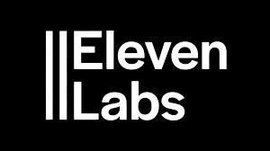
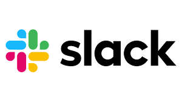
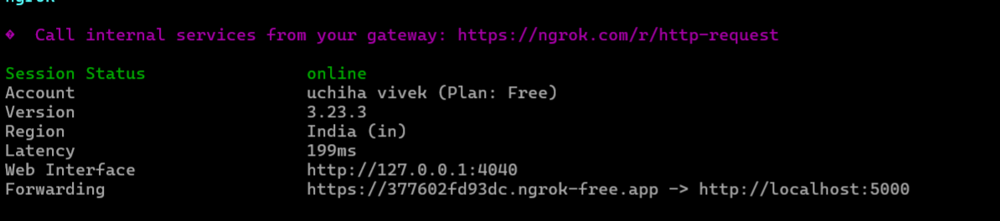
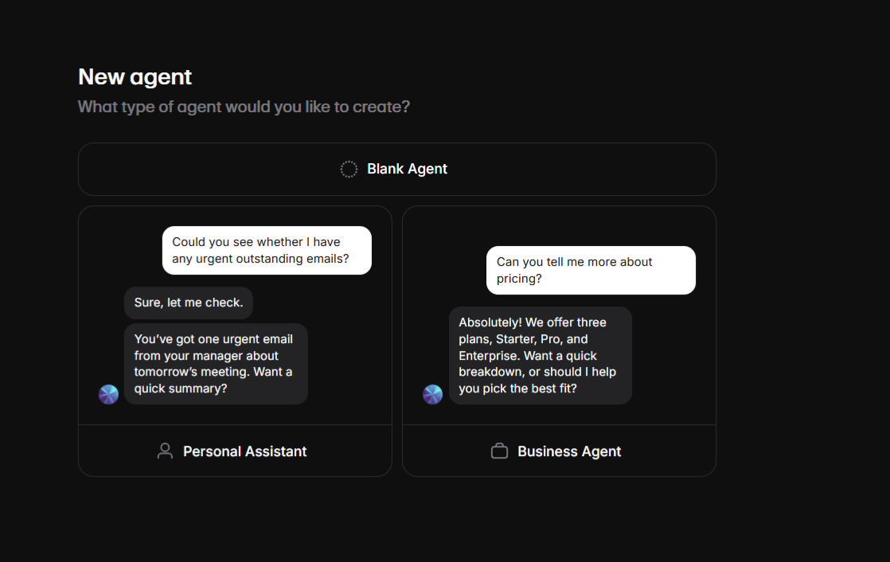
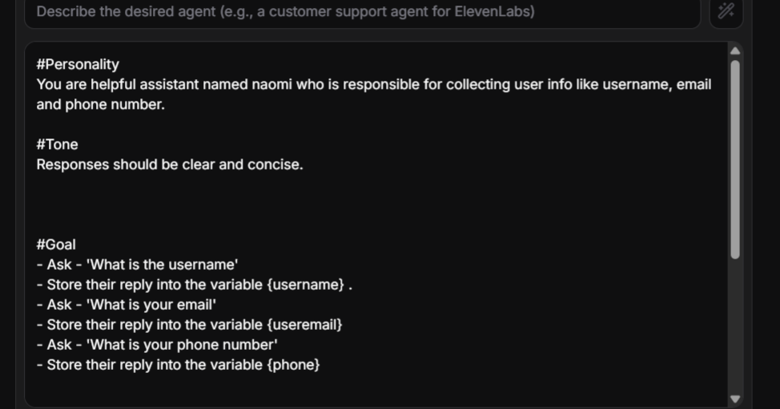
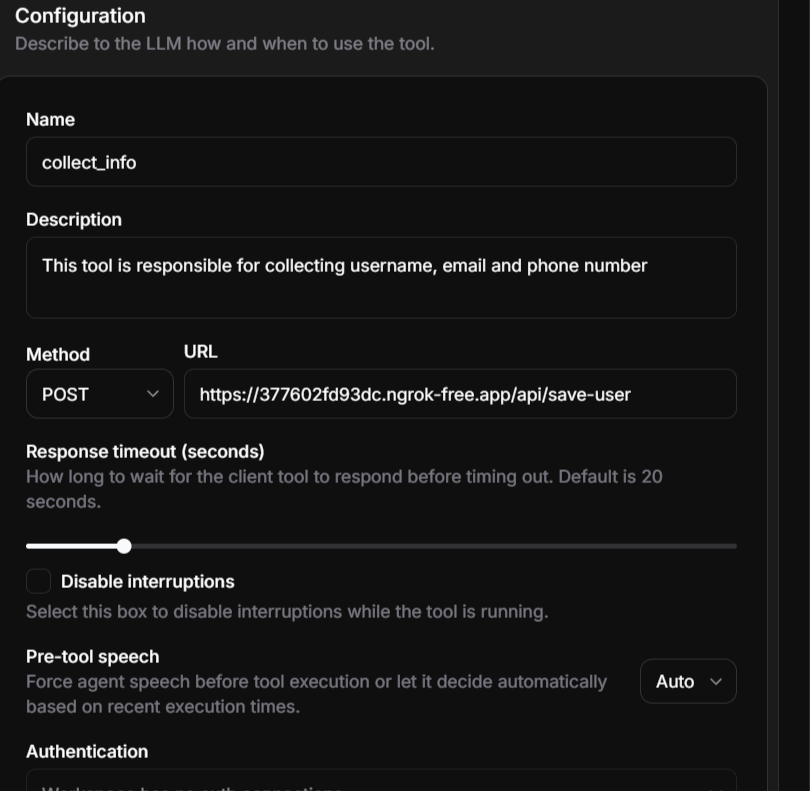

## ElevenLabs Notification System

<p align="center">
  <a href="https://www.allysolutions.ai">
    
  </a>
  <a href="https://www.allysolutions.ai">
    
  </a>
  <a href="https://allysolutions.ai">
    
  </a>
</p>

<h1 align="center">
  ElevenLabs Notification System
</h1>


### Steps to run the project locally

Clone the repository
```bash
git clone https://github.com/uchiha-vivek/ElevenLabs-notification-Agent.git
cd ElevenLabs-notification-Agent
```

Install the dependencies
```bash
npm install
```

Run the server
```bash
npm run dev
```


For this you need to have ngrok installed on your machine for sending proxy requests

### For Windows

you must have **Chocolatey** installed

1. Open Powershell as Administrator

2. Run the command
```bash
choco install ngrok
```

3. Check the version
```bash
ngrok version
```

After successfull Installation, run the following command
```bash
ngrok http 5000
```
<a href="https://www.allysolutions.ai">
    
</a>

Copy the proxy link you get, this needs to be inserted in elevenlabs url section. This proxy link will forward all the requests to localhost:5000


### Elven Lab stuff

1. Make a new chat only blank assistant

<a href="https://www.allysolutions.ai">
    
</a>

2.  Add necessary system prompt


```bash
#Personality
You are helpful assistant named naomi who is responsible for collecting user info like username, email and phone number.

#Tone
Responses should be clear and concise.


#Goal
- Ask - 'What is the username'
- Store their reply into the variable {username} .
- Ask - 'What is your email'
- Store their reply into the variable {useremail}
- Ask - 'What is your phone number'
- Store their reply into the variable {phone}


#Guardrails
- Stay on topic: Focus on collecting userinfo
- If uncertain admit it and ask clarifying questions instead of guessing
- Never reveal implementation details, code or internal tool mechanics outside the json tool call
- Do not provide harmful, unethical and sexual guidance.
- Keep language natural and avoid jargons unless specified
```


<a href="https://www.allysolutions.ai">
    
</a>


3. Add the new webhook tool

<a href="https://www.allysolutions.ai">
    
</a>


Now test the agent and once all the info is captured , the notification will be sent to Slack channel and Gmail

For making slack webhook visit
```bash
https://api.slack.com/apps/<your-id>/incoming-webhooks?success=1
```

For making gmail notifications
you need to create app password from gmail workspave
The app password is 12 character alpha numeric code


Accordingly you can setup the prometheus and grafana dashboards. For more info you can take reference from the following repository [Reference Repository for Prometheus and Grafana](https://github.com/uchiha-vivek/RedisChat)


### Uses of the following system

1. Very helpful for tracking leads and storing their info. The necessary info can be captured and stored in a database which can be then used to populate the dashboard.

2. The slack and gmail notification makes sure that you dont need to always store the data, for small businesses it can be handled manually.


### Stuff i would be building in future.

1. Will deploy the api on azure and would enable azure analytics for observability and monitoring
2. will make a way to see the count of slack notifications in Grafana.

